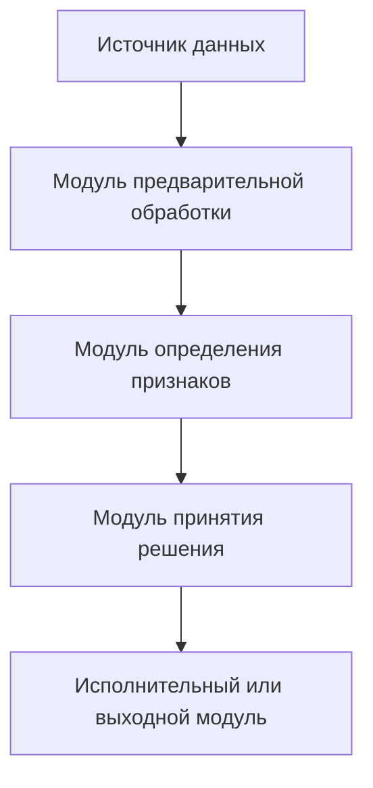
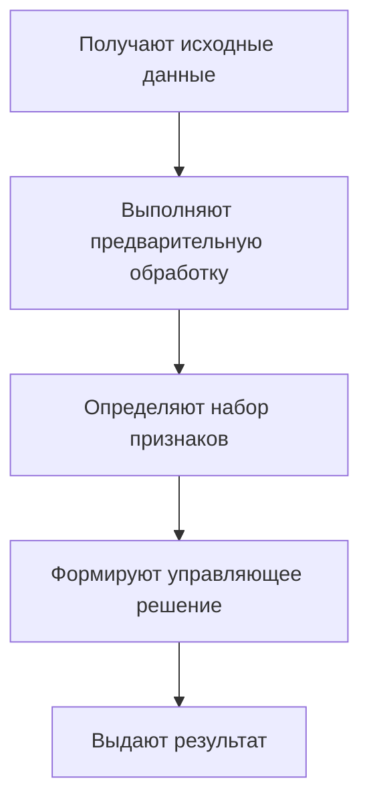

# Справочник шаблонов российской заявки

Этот файл дополняет `disclosure_builder.md` и используется при сборке описания, формулы, реферата и фигур.

## Заявочные сведения

```markdown
## Заявочные сведения

**Тип заявки**: изобретение

**Название изобретения**: [подлежит уточнению]

**Заявитель**: [подлежит уточнению]

**Автор(ы)**: [подлежит уточнению]

**Технический контакт**:
- имя: [подлежит уточнению]
- телефон: [подлежит уточнению]
- email: [подлежит уточнению]

**Примечание для патентного специалиста**: материал является техническим черновиком и требует юридической проверки перед подачей.
```

## Описание изобретения

### Название изобретения

Название должно отражать объект и назначение:

- `Способ ...`
- `Система ...`
- `Устройство ...`
- `Машиночитаемый носитель ...`
- `Способ и система ...` для связанной группы решений.

### Область техники

Кратко укажи техническую область без маркетинговых формулировок:

```markdown
Изобретение относится к области обработки данных программируемыми вычислительными средствами, а именно к способам ...
```

### Уровень техники

Рекомендуемая структура:

```markdown
Из уровня техники известны решения, в которых ...

Источник 1: [номер/название], [ссылка]. Решение раскрывает ... Недостатком является ...

Источник 2: ...

Наиболее близким аналогом может рассматриваться ..., поскольку он совпадает с заявляемым решением по ...
Однако такой подход не обеспечивает ..., так как ...
```

Ссылка должна быть проверяемой. Если один документ найден в ФИПС и Google Patents, используй ФИПС как официальный источник библиографии, а Google Patents как дополнительную страницу семейства или перевода.

### Раскрытие сущности изобретения

Обязательная логика:

```markdown
Техническая проблема состоит в ...

Технический результат заключается в ...

Указанный технический результат достигается тем, что ...
```

Далее раскрой существенные признаки. Для каждого важного признака покажи, почему он нужен для результата. Если есть группа решений, объясни общий технический признак и единый изобретательский замысел.

### Краткое описание чертежей

```markdown
На фиг. 1 представлена структурная схема системы.
На фиг. 2 представлена блок-схема способа.
На фиг. 3 представлен пример структуры данных.
```

Не упоминай фигуру, которой нет в разделе `Фигуры`, и не оставляй в фигурах несогласованные позиции.

### Осуществление изобретения

Пиши от общего к частному:

- среда выполнения;
- компоненты и их связи;
- последовательность операций;
- параметры и диапазоны;
- обработка исключительных условий;
- пример реализации;
- технический результат в примере.

Для IT-решений раскрывай материальные средства: вычислительное устройство, память, процессор, сеть, датчики, исполнительные устройства, если они участвуют в результате. Не оставляй алгоритм как абстрактную математику без технического контекста.

## Формула изобретения

### Способ

```markdown
1. Способ [назначение], выполняемый с использованием [техническое средство], включающий:
получают ...;
определяют ...;
формируют ...;
передают ...;
при этом ...
```

### Система или устройство

```markdown
1. Система [назначение], содержащая:
[первый модуль/устройство], выполненный с возможностью ...;
[второй модуль/устройство], связанный с ... и выполненный с возможностью ...;
при этом ...
```

### Машиночитаемый носитель

```markdown
1. Машиночитаемый носитель, содержащий программу, которая при выполнении процессором обеспечивает осуществление способа по любому из пунктов ...
```

### Зависимые пункты

Зависимые пункты должны уточнять, а не повторять независимый пункт:

- частные диапазоны параметров;
- предпочтительный порядок операций;
- конкретные варианты модулей;
- условия переключения режимов;
- варианты данных и сигналов;
- дополнительные проверки или фильтрацию.

## Реферат

Шаблон:

```markdown
Изобретение относится к [область техники]. [Объект] предназначен для [назначение].
Сущность заключается в том, что [ключевые признаки независимого пункта].
Технический результат состоит в [результат]. [При необходимости: ил. N].
```

Рекомендуемый объем: до 1000 печатных знаков.

## Mermaid для рабочих фигур

### Структурная схема



### Блок-схема способа



После генерации итогового Markdown эти блоки должны быть преобразованы в PNG через `mermaid_render.py`.

## Проверка терминов

- один термин = один смысл во всем документе;
- термин из формулы должен быть раскрыт в описании;
- позиция на фигуре должна соответствовать тексту;
- технический результат должен быть причинно связан с признаками, а не с коммерческой выгодой;
- параметры и диапазоны в формуле, описании и примерах должны совпадать.

## Что не писать

- служебные ссылки на этот skill или репозиторий;
- учебные дисклеймеры из примеров;
- утверждения о гарантированной регистрации;
- признаки, не раскрытые в описании;
- длинные цитаты из найденных патентов или abstract.
